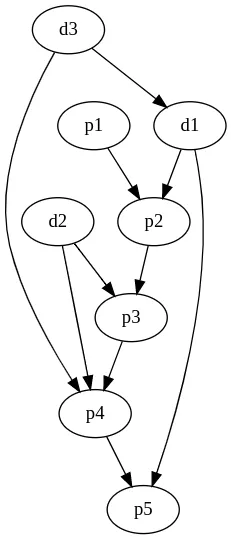
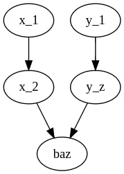
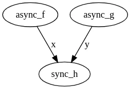

# Graph Programming

Imperative programming is characterized by iterative nesting. A function has embedded calls to other ones. By embedded I mean that these calls are in the function body, and so there is a tight coupling between a function and its constituents. This has many shortcomings and is typically solved by function composition.

Composition is like taking two things and connecting them. Not one thing is on top of, embedded or superior to the other, they just feed into each other. Consequently the functions involved are oblivious to one another, which is great because you get to mix and match, test and debug them separately.

Most composition utils or libraries will generate a new function or object that represents the composition of its constituents, but it is no longer possible to refer to the constituents. You sort of get a new impenetrable box (nesting all over again).

In typical composition you can continue composing into or out of this box, as long as the composition is done on the sides, and not the individual constituents. However, if you have non-unary functions, you need to start using currying and things may get complicated.

As humans we don’t think or talk this way, we can refer to concepts arbitrarily and compose freely in a non-unary fashion.

This work presents the notion of graph programming, a way to program by building graphs of functions from connecting pairs of functions in a non-enclosing way, and aims to replace typical function composition.

## Prerequisites

I will use python to illustrate my examples. I will also be using a functional programming style.

You should be familiar with compose_left , pipe and curry to follow along.

In case you are not, here are plausible implementations for the first two:

```python
def compose_left(\*funcs):
    def composition(input):
    for f in funcs:
    input = f(input)
    return input

        return composition

def pipe(input, funcs*):
    return compose_left(*funcs)(input)

```

As for curry since its implementation is a bit less trivial you can use this usage example to get an idea about what it does:

```python
@curry
def add(x, y):
    return x + y

# I can give a single argument, getting back a function that
# expects the remaining argument.

add_5 = add(5)
add_5(7) # Will give 12.
```

## Non linear programs

Consider the following situation, where you have the following pipeline:

```py
foo = compose_left(x_1, x_2, ..., x_n)
```

foo is a composition of some functions. Great.

Now imagine the case where x_n gets two arguments, instead of just one. So we can no longer have this composition by itself, and we are required to use currying and an extra def like so:

```py
@curry
def x_n(arg1, arg2):
    ...

def make_foo(head_input, side_input):
    return pipe(
        head_input,
        x_1,
        x_2,
        ...,
        x_n(side_input)
    )
```

Currying is great, because we don’t need to complicate x_n to express that it will get its two dependencies in two different places in the code. side_input will find its way into x_n as arg2.

Still there is some leakage here. We needlessly expose the rest of the composition code to side_input. This could become pretty messy if I have many dependencies, and I want to give them at different times.

Consider the case where x_n is a member of two independent pipelines, each giving it a different input.

We might try to program it like this (which obviously won’t work):

```py
def baz(arg1, arg2):
    ...

# incoming argument on position 2
foo = compose_left(x_1, x_2, ..., baz)

# incoming argument on position 2
bar = compose_left(y_1, y_2, ..., baz)

```

Calling foo or bar would give us a familiar exception about baz expecting two arguments but got only one.

We can overcome this with some imperative style:

```py
def everything(head_arg1, head_arg2):
    return baz(
        pipe(head_arg1, ...),
        pipe(head_arg2, ...),
    )
```

And while this works for simple cases, it would not scale to the general case. If I had several functions connected at different stages, I would then have to give up the composition notation and end up in imperative style, or simply have a single large function where everything is exposed to everything.


Complex dependency structure

Imagine having to write a single signature to support the above structure. It would have to be the union of d3, d1, p1, d2. The function body itself would expose the variables globally, and it would be pretty hard to understand the dependency structure.

As humans it’s pretty obvious how to express it. We just draw it. Let’s get back to the simple example above.


No currying needed when you can draw

We can “code” it too, for example this is the code I used to generate the above image:

```
digraph G {
    x_1 -> x_2 -> baz
    y_1 -> y_z -> baz
}
```

So I should be able to do the same when programming.

Prographers
The word “graph” itself comes from drawing or painting, and this is really the right sense. We want to be able to draw programs, because our mental models of them are nonlinear structures\*.

\*The word programming itself comes from the earlier Greek word “prographein”. We are all really just prographers.

https://github.com/hyroai/computation-graph implements the first graph-programming framework, in python.

It allows taking pure functions written in plain python, and declare their dependencies explicitly, without them being aware of each other. That is similar to any function composition framework. What cg does beyond that is a few other tricks.

## Non linear composition

The first trick is generalizing composition to non unary functions, and pipelines to directed acyclic graphs (DAGs). Dependencies are not only “lines”, and so we should be able to, for example, connect two lines into a binary function. I only need to state the keyword I’m composing on to make this example complete.

An example:

```py
everything = to_callable([
    *compose_left(x1, ..., x_n-1),
    *compose_left(x_n-1, baz, keyword="arg1"),
    *compose_left(y1, ..., y_n-1),
    *compose_left(y_n-1, baz, keyword="arg2"),
])
...
# usage:
everything(input_to_x_chain, input_to_y_chain)
```

Each composition is essentially a collection of edges, with some syntactic sugar that allows you to create substructures easily.

## Memory

Pure functions and compositions are easy to work with. They are easy to test and reason about, and are not exposed to pesky state. But still reality needs programs with memory, or programs which are run a few times and retain some context so we needed to introduce state or memory into pure functions. The popular UI framework React has solved this problem using hooks (e.g. useState). We wanted to be more strict in the purity of the functions that we use, and not introduce any magic calls within the function. In other words we wanted the input to be fully described within the function’s parameter, and output to be fully defined as the function’s output.

We started by implementing a special kind of node, called a reducer. The reducer returns two elements, an output and its memory, and the computation graph framework would give the function its memory on the next “turn”, in a special argument called state (similar to self in python).

We then realized that this pattern can be implemented in a much simpler way, without any special keyword arguments or constructs. We realized that memory is a dependency into the future. Future here means the next time you run the computation graph. And so we changed the implementation to have something we call “future edges”. Future edges describe function composition in the axis of time. So a function can be composed (namely have an edge) onto itself or a some other functions (even functions it supposedly depends on!), without really creating loops. This is because the value needed for the current turn exists from the previous turn.

When we introduce this concept, we are no longer talking about DAGs, but general graphs, that may have “cycles” (as long as the cycle has at least one future edge to break it).

Note that when we introduced memory the signature of the entire computation graph becomes two elements, where one is the output and the other is the state, and when we run it again, we make sure to give it the state from the previous turn. So when zooming out, the entire computation graph has the signature of a reducer function.

## Logging

Logging is a classic problem in programming. We write some code to do something, then we want to watch it and log what it is doing. As an example consider the pipeline compose_left(x, y, z_1, ..., z_n).

And say we would like to watch the output of y. So we might do something like this:

```py
def y(some_input):
    ...
    return output, log
```

But alas,z_1 expects to get the output of y. This means we would have to complicate z_i to handle a pair of elements. We would like to avoid it. With graph programming this is trivial to do. Simply connect y into two facets:

```py
(
    *compose_left(x, y, z_1, ..., z_n),
    *compose_left(y, logger),
    *compose_left(logger, final_output, key="log"),
    *compose_left(z_n, final_output, key="real_output"),
)
```

## Async programming

Async in python is really hard to get right. Synchronous functions cannot call async ones and so mixing the two is nontrivial to say the least. In addition you have to carefully select when to await in two consecutive lines, and when to use things like asyncio.gather. But this information, of what needs to happen first, is already in your program. For example, the following example is not efficient.

```py
async def my_async_program():
    x = await async_f()
    y = await async_g()
    return sync_h(x=x, y=y)
```

This is because we can await on x in parallel to y. But why should we notice it as humans, instead of having it be inferred?

If we draw it, it becomes obvious.



And so the computation graph library lets you mix async and synchronous functions, and even infers for you, using a topological sort, what can be run in parallel. This would be written as follows.

```py
(
    *compose_left(async_f, sync_h, key="x"),
    *compose_left(async_g, sync_h, key="y"),
)
```

## Ambiguity

Another cool feature is that you can actually compose more than one option onto a function, making the graph sort of like a nondeterministic model. This implies that the input can come from either edge. To make results predicable, these edges have priorities, so the computation graph will try the more prioritized edge first, and only if that computation path does not succeed (namely raises a specific exception), will the graph runner attempt a different path.

```py
(
    make_edge(f1, g, key="some_kwarg", priority=0),
    make_edge(f2, g, key="some_kwarg", priority=1),
)
```

In the above code, g might get its input from f1 or if that doesn’t work, from f2. Note we use the lower level API here, but this is very similar to compose_left.

## TODO: Loops

The computation graph does not yet support loops. When it will, they would probably be implemented as a special edge as well. This is still in early planning, comments about this (or PRs) are welcome.

## Small note: Computation graphs and monads

Some of the problems discussed above are traditionally solved by monads in functional programming languages. Because I am not experienced myself with working with monads, I choose to leave it for the reader to determine the relationship of graph programming and monads, and may revisit this section in the future.
